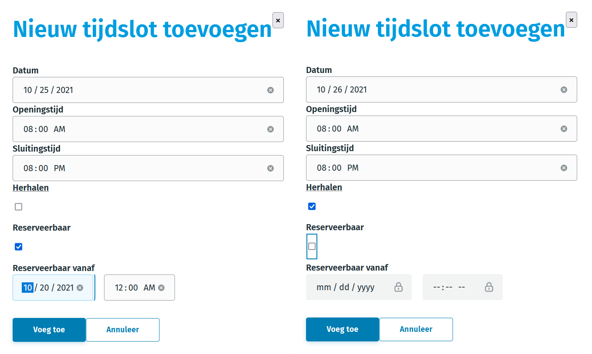

# Gebruikershandleiding - beheerder

Hier zal je alle informatie vinden over de beheerder functionaliteiten van de Studieplekken applicatie. Er zijn twee grote secties, namelijk beheer en scan. Wanneer je als beheerder op je naam klikt rechtsboven zal je een drop-down krijgen waar "Beheer"/"Management" staat en "scan". Het aanmaken en algemene beheer van gebouwen, ruimtes, tags,... zal je daar terugvinden. In scan zal je functionaliteiten vinden voor opnemen van studenten aanwezigheden.

# Beheer/Management

In de linker kolom staat het hoofd menu met verschillende onderwerpen waarover je meer informatie kan verkrijgen.

## Gebouw
Een gebouw kan je beheren in het gebouw rubriek van beheer. Op deze pagina heb je een oplijsting van alle gebouwen die onder jouw beheer zijn. Elk gebouw heeft zijn adres als gegeven en bij welke institutie het behoort. Om meer details te zien ga je best naar bewerken.

Om een nieuwe locatie aan te maken ga je helemaal onder de lijst van gebouwwen en klik op de knop "Nieuw gebouw". Hier zal je een naam, adres en institutie moeten ingeven. 

## Studie-ruimte

 

### Initiële aanmaak/verwijdering
Een studieplek staat in de rubriek ruimte. Dit zijn zalen of delen van een gebouw die studenten kunnen reserveren. Op deze pagina zal je een naam zien, de autoriteit die deze ruimte beheert en "plaatsen" is de capaciteit die de kamer heeft.

Om meer gedetaileerde informatie te bekomen druk je op bewerken

Een ruimte heeft de mogelijkheid om open te staan voor groepsreservaties. In dit geval is het voldoende dat één persoon deze ruimte reserveert. Individuele reservaties zullen dan niet meer mogelijk zijn.

Opnieuw is er onderaan in de lijst van ruimtes een knop om ruimtes toe te voegen.

! Let op, als de toevoeg knop niet activeert kan het zijn omdat je niet alle verplichte velden hebt ingevult. Dit kan het gevolg zijn van een te kleine venster. Het kan dus zijn dat je nog moet scrollen in het formulier zelf om de eventueel "verborgen" elementen te zien.

 

### Beheer van ruimte
Als je op bewerken klikt kan je bewerkingen maken op de ruimte. Op deze pagina kan je een aantal dingen gaan bewerken:

Druk op de knop "Pas aan" om de basis gegevens van een ruimte aan passen (zitplaatsen, naam van de ruimte,...). Bij het finaliseren van de laatste bewerkingen druk je op de "Oké"-knop klikken om de veranderingen op te slaan en "Annuleren" om aanpassingen ongedaan te maken.

Een ruimte kan bepaalde eigenschappen hebben waar gebruikers naar op zoek zijn. Zo kan het zijn dat je duidelijk zou willen maken dat er computers of groepsruimtes beschikbaar zijn in een bibliotheek. Dit doe je op basis van de "tags". De tags zijn etiketten die gemaakt zijn op in de beheer pagina, subrubriek tags. Deze vooraf gemaakte tags kan je dan toevoegen aan je ruimte. Zo zullen ze zichtbaar zijn voor studenten tijdens het kiezen van een ruimte. Voor meer informatie over het aanmaken van tags kijk je naar het volgende puntje.

Openingsuren van de ruimtes kan je vinden onderaan op deze pagina.

Ps: Het is ook mogelijk om in de bewerking-modus te geraken vanuit het dashboard. Als je naar het dashboard gaat en een specifieke ruimte selecteert zal je alle informatie zien dat een student ook zal krijgen over een locatie. Om eender welke bewerkingen door te voeren als beheerder zal je eerst op de beheer-knop moeten klikken rechts naast de titel van de ruimte. Dit verhelpt dat er perongeluk aanpassingen zouden gemaakt worden.

### TODO testen van groepsreservatie en verwijderen

 

## Tags

Tags of etiketten zijn eigenschappen die ruimtes kunnen hebben. Zo kan je bijvoorbeeld aangeven dat er computers zijn in deze ruimte door een tag "pc". Een tag moet je eerst aanmaken voordat je ze kan gebruiken op een studieruimte. Aanmaak kan je vinden onder "Beheer > Tags". Geef altijd zowel een Nederlandse als Engelse benaming zodat internationale studenten/medewerkers ook alle informatie hebben. 

 

## Gebruikers
Gebruikers in het systeem kan je opzoeken aan de hand van de voornaam, achternaam of barcode. Je kan de voornaam en achternaam combineren tijdens de zoektocht maar beide moeten precies overeenkomen met de namen in de databank. Verschillen in hoofdletters en kleine letters zijn echter geen probleem. 

Een barcode is een code die elke student bij reservatie zal ontvangen. Op basis van de barcode is het ook mogelijk om een gebruiker op te zoeken.

 

## Tijdsloten aanmaken
Nieuwe tijdsloten kunnen worden aangemaakt via het reservatiebeheer scherm. Dit is te vinden onder "Beheer > Ruimtes".

Onder reservatiebeheer is er een knop met "Voeg nieuwe openingsperiode toe". Hiermee kunnen er nieuwe tijdsloten worden aangemaakt. 

Er zijn twee soorten tijdsloten: reserveerbare en niet-reserveerbare. Niet-reserveerbare tijsloten kunnen mensen naar toe gaan om te studeren zonder te hoeven gescanned te worden. Hier is dan ook niet noodzakelijk een toezichthouder voor nodig. Verder kan een tijdslot gemarkeerd worden als "herhaalbaar". Dit zorgt dat reservaties zullen worden gesugereerd voor volgende weken.

Hier is een voorbeeld van:
* een niet-herhalende reserveerbare tijdsslot
* een herhalende niet-reserveerbare tijdslot

Herhalende tijdsloten worden gesugereerd in volgende weken. Deze kunnen dan goedgekeurd worden door te klikken op de "Keur goed" knop.
Alle herhalende tijdsloten kunnen in één keer goedgekeurd worden door te klikken op de "Keur alle suggesties goed" knop.

PS: Lukt het niet om een reservatie slot aan te maken? Kijk zeker na of je ook altijd de minuten nauwkeurig zelf hebt ingevuld. Soms kan het zijn bv op Safari dat de minuten in het licht-grijs staan, wat wil zeggen dat je deze nog niet hebt ingevuld!

 

## Nog vragen?

Indien er nog vragen zijn waar je niet uitgeraakt kan je ons vinden op het volgend adres: 
info-medewerkers@studieplekken.ugent.be.